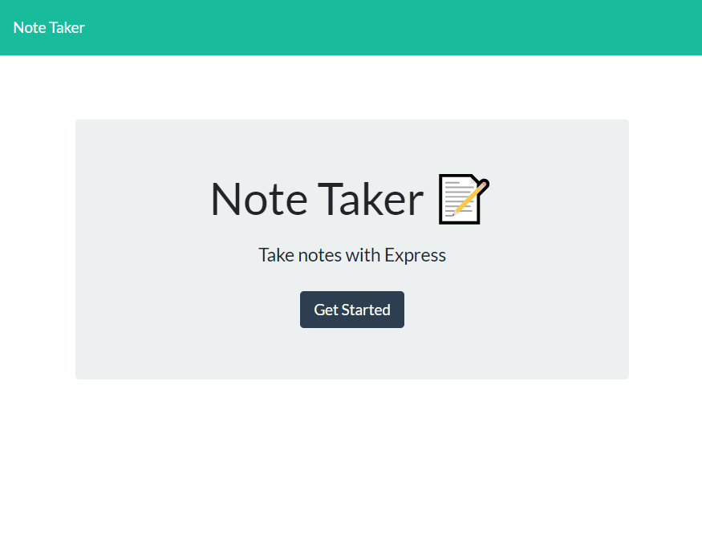
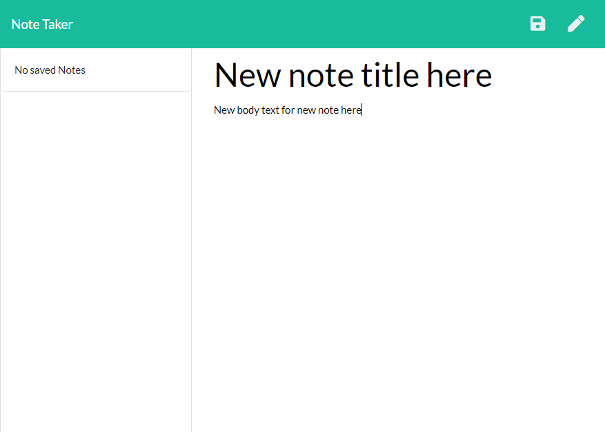

# The Note Taker

## Table of Contents
* [Description](#description)
* [Usage](#usage)
* [Installation](#installation)
* [Screenshots](#screenshots)

## Description
This program lets the user take notes and save them to a list of notes. Then, once the user is done with the note, the note can be deleted. The information is being saved on a server. 

This was my first project which is hosted on Heroku. 

## Usage
For this application, you just enter a note title and note text, then click the save button to save the information. The saved information is added to a list of notes on the left of the screen. Each note has a trashcan and clicking that trashcan will delete that note from the list. 

## Installation
This application requires a server connection and requires an npm install for express. 

## Screenshots
Here is a screenshot of the homepage of the application and of the page where notes are entered.

